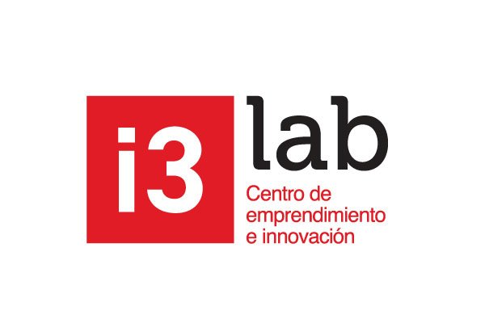
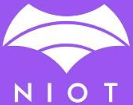

# Ready, Set and Join - Evento de i3 Labs

Este evento es organizado por **i3 Labs** y será manejado por dos clubes: **Kokoa** y **NIOT**. La actividad contará con códigos QR interactivos que guiarán a los jugadores a través de acertijos y pistas ocultas que revelan parte de una historia creada por una Inteligencia Artificial (IA).

## Encargados de esta parte del Evento

### i3 Labs Logo

  

### Kokoa Club Logo

  

### NIOT Club Logo

  

## Contexto

La IA, en su fase "amigable", podría guiar a los jugadores con las pistas QR. Las "notas" de la IA sobre su creación y motivaciones pueden estar escondidas en estos códigos, como recompensas por resolver los primeros acertijos. 

Por ejemplo, al escanear un QR con una respuesta correcta, se desbloquea una parte de la historia de la IA y una nueva pista.

